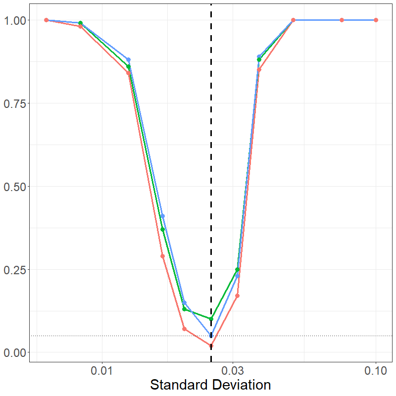
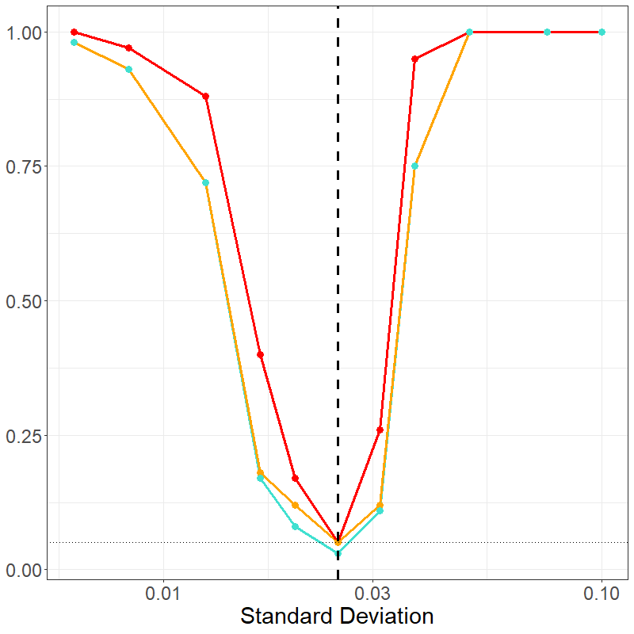

```{r, include = FALSE}
knitr::opts_chunk$set(
  collapse = TRUE,
  comment = "#>"
)
```

```{r setup}
library(funkycells)
```

```{r define_functions, echo=FALSE}
# This indicates if power curves should be built or saved loaded
#   WARNING, this takes a long time to run!!
#     If you wish to run, I recommend you run the code in chucks
full_run <- FALSE 
path <- './model_power_curves/'
```

This vignette shows the power curve for the model. This curves are based on data similar to that in the triple negative breast cancer data, for which there is another vignette  `vignette("TNBC")`. To this end, we consider two cases: (1) a few number of interactions and (2) a large number of interactions.

In both cases, we consider the $c1\_c2$ interaction of varying strength and trend between two outcomes. In the null case, there is some clustering of $c2$ around $c1$ in both cases (the placing normal distribution using a standard deviation of 1/40). There are 5 cases on either side of this value, i.e. increased clustering or repulsion. Additional variables are generated: an additional $2$ cells in small and $14$ cells in the large cases are added, and meta-variable age is included.
```{r common_definitions}
nSims <- 100
changes <- 1/40 * c(4,3,2,1.5,1.25,
                    1,
                    1/1.25,1/1.5,1/2,1/3,1/4)
baseline <- changes[6]
```

For the small number of interactions scenario, we consider $4$ cells and interactions between them.
```{r cells_small, eval=full_run}
cells <- paste0('c',1:4)
cells_interactions <- rbind(data.frame(t(combn(cells,2))),
                            data.frame('X1'=cells,'X2'=cells))

```

Next the data is generated, $100$ data sets for each scenario (as given below).
```{r gen_small, eval=full_run}
info <- rfdata <- list()

for(c in 1:length(changes)){
  cat(paste0('\n- Change: ',changes[c],'\n-- (',nSims,'): '))

  set.seed(c*123)

  for(i in 1:nSims){
    cat(paste0(i,', '))
    # Generate
    dat <- simulatePP(cellVarData=
                        data.frame('stage'=c(0,1),
                                   'c1'=c(0,0),
                                   'c2'=c(baseline,changes[c])^2,
                                   'c3'=c(1/50,1/50),
                                   'c4'=c(1/10,1/10)),
                      cellKappaData=data.frame(
                        'cell'=paste0('c',1:4),
                        'clusterCell'=c(NA,'c1','c1', NA),
                        'kappa'=c(30,
                                  5,5,
                                  30)),
                      peoplePerStage=17,
                      imagesPerPerson=1,
                      silent=T)
    pcaData <- getKsPCAData(data = dat,repeatedUniqueId='Image',
                            xRange = c(0,1), yRange = c(0,1),
                            agents_df = cells_interactions,
                            silent=TRUE)
    pcaMeta <- simulateMeta(pcaData,
                            metaInfo = data.frame(
                              'var'=c('age'),
                              'rdist'=c('rnorm'),
                              'Stage_0'=c('25'),
                              'Stage_1'=c('25')))
    info[[i]] <- list(dat,pcaData,pcaMeta)
    rfdata[[i]] <- pcaMeta
  }

  ## Save RDS
  saveRDS(info, paste0(path,'change_sim_small_info',c,'.rds'))
  saveRDS(rfdata, paste0(path,'change_sim_small_rfdata',c,'.rds'))
}
```

After generation, the model is fit on all of these data sets.
```{r model_small, eval=full_run}
for(c in 1:length(changes)){
  cat(paste0('\n- Change: ',changes[c],'\n-- (',nSims,'): '))

  rfdat <- readRDS(paste0(path,'change_sim_small_rfdata',c,'.rds'))

  VarVI_both <- VarVI_noi <- VarVI_int <-
    VarVI_maxint <- VarVI_bothmax <-
    data.frame('var'=c('age',
                       paste(cells_interactions$X1,
                             cells_interactions$X2,sep='_')))

  set.seed(c*12345)

  for(i in 1:nSims){
    cat(paste0(i,', '))
    # Generate

    rfcv <- funkyModel(data=rfdat[[i]],
                       outcome = 'Stage', unit = 'Person',
                       metaNames=c('age'), silent = TRUE)

    # Org Data
    tmp <- rfcv$VariableImportance[,c('var','est','sd')]
    tmp <- tmp[order(-tmp$est),]
    rownames(tmp)<-NULL
    tmp$CutoffNoise <- rfcv$NoiseCutoff
    tmp$CutoffInterp <- rfcv$InterpolationCutoff
    tmp$CutoffMaxInterp <- max(rfcv$InterpolationCutoff)

    # Above Lines
    tmp$TF_intCO <- (tmp$est > tmp$CutoffInterp)
    tmp$TF_noiCO <- (tmp$est > tmp$CutoffNoise)
    tmp[[paste0('iter',i)]] <- tmp$TF_intCO * tmp$TF_noiCO
    VarVI_both <- merge(VarVI_both,tmp[,c('var',paste0('iter',i))])
    tmp[[paste0('iter',i)]] <- tmp$TF_noiCO
    VarVI_noi <- merge(VarVI_noi,tmp[,c('var',paste0('iter',i))])
    tmp[[paste0('iter',i)]] <- tmp$TF_intCO
    VarVI_int <- merge(VarVI_int,tmp[,c('var',paste0('iter',i))])

    tmp$TF_maxIntCO <- (tmp$est > tmp$CutoffMaxInterp)
    tmp[[paste0('iter',i)]] <- tmp$TF_maxIntCO * tmp$TF_noiCO
    VarVI_bothmax <- merge(VarVI_bothmax,tmp[,c('var',paste0('iter',i))])
    tmp[[paste0('iter',i)]] <- tmp$TF_maxIntCO
    VarVI_maxint <- merge(VarVI_maxint,tmp[,c('var',paste0('iter',i))])

  }

  ## Save RDS

  results[[paste0('Change_',changes[c])]] <-
    list('dat'=tmp, 'fullDat'=list(rfcv$VariableImportance,
                                   rfcv$NoiseCutoff,
                                   rfcv$InterpolationCutoff),
         'VarVI_both'=VarVI_both,
         'VarVI_noi'=VarVI_noi,
         'VarVI_int'=VarVI_int,
         'VarVI_bothmax'=VarVI_bothmax,
         'VarVI_maxint'=VarVI_maxint)

  ## Save RDS
  saveRDS(results, paste0(path,'change_sim_small_',c,'.rds'))
}
```

The data is then summarized together:
```{r summarize_small, eval=full_run}
data <- list()
for(i in 1:11){
  data <- append(data, 
                 readRDS(paste0(path,'change_sim_small_',i,'.rds')))
}

data_summary <- data.frame('var'=changes, 'noi'=NA, 'int'=NA,
                           'both'=NA, 'max'=NA, 'bothmax'=NA)

for(i in 1:length(data)){
  data_summary[i,'noi'] <-
    sum(data[[i]]$VarVI_noi[data[[i]]$VarVI_noi$var=='c1_c2',-1]) /
    length(data[[i]]$VarVI_noi[data[[i]]$VarVI_noi$var=='c1_c2',-1])

  data_summary[i,'int'] <-
    sum(data[[i]]$VarVI_int[data[[i]]$VarVI_int$var=='c1_c2',-1]) /
    length(data[[i]]$VarVI_int[data[[i]]$VarVI_int$var=='c1_c2',-1])

  data_summary[i,'max'] <-
    sum(data[[i]]$VarVI_max[data[[i]]$VarVI_max$var=='c1_c2',-1]) /
    length(data[[i]]$VarVI_max[data[[i]]$VarVI_max$var=='c1_c2',-1])

  data_summary[i,'both'] <-
    sum(data[[i]]$VarVI_both[data[[i]]$VarVI_both$var=='c1_c2',-1]) /
    length(data[[i]]$VarVI_both[data[[i]]$VarVI_both$var=='c1_c2',-1])

  # (max either)
  data_summary[i,'bothmax'] <-
    sum(data[[i]]$VarVI_bothmax[data[[i]]$VarVI_bothmax$var=='c1_c2',-1]) /
    length(data[[i]]$VarVI_bothmax[data[[i]]$VarVI_bothmax$var=='c1_c2',-1])
}

data_plot <- tidyr::pivot_longer(data_summary,cols=noi:bothmax)
```

And a power curve is built:
```{r show_small, eval=full_run}
plot_sm <- 
  ggplot2::ggplot(
    data_plot[data_plot$name %in% c('noi','int','both'),],
    ggplot2::aes(x=var, y=value, color=name, group=name)) +
  ggplot2::geom_line(linewidth=1.25) +
  ggplot2::geom_point(size=3) +
  ggplot2::geom_vline(
    ggplot2::aes(xintercept=baseline),
    color='black', linetype='dashed', linewidth=1.25) +
  ggplot2::geom_hline(
    ggplot2::aes(yintercept=0.05), linetype='dotted') +
  ggplot2::theme_bw() +
  ggplot2::theme(axis.text=ggplot2::element_text(size=18),
                 axis.title = ggplot2::element_text(size=22),
                 legend.position = "none",
                 legend.title = ggplot2::element_text(size=22),
                 legend.text = ggplot2::element_text(size=18)) +
  ggplot2::xlab('Standard Deviation') +
  ggplot2::ylab(NULL) +
  ggplot2::scale_x_log10()

plot_sm
```
```{r show_fake_small, eval=!full_run}

```


The large model is created in much the same manner, only using $16$ total cells and their interactions.
```{r cells_large, eval=full_run}
cells <- paste0('c',1:16)
cells_interactions <- rbind(data.frame(t(combn(cells,2))),
                            data.frame('X1'=cells,'X2'=cells))
```

Followed by data generation for $100$ trials per scenario:
```{r gen_large, eval=full_run}
info <- rfdata <- list()

for(c in 1:length(changes)){
  cat(paste0('\n- Change: ',changes[c],'\n-- (',nSims,'): '))

  set.seed(c*1234)

  for(i in 1:nSims){
    cat(paste0(i,', '))
    # Generate
    dat <- simulatePP(
      cellVarData=
        data.frame('stage'=c(0,1),
                   'c1'=c(0,0),
                   'c2'=c(baseline,changes[c])^2, 'c3'=c(1/50,1/50),
                   'c4'=c(0,0), 'c5'=c(0,0), 'c6'=c(0,0),
                   'c7'=c(0,0), 'c8'=c(0,0), 'c9'=c(0,0),
                   'c10'=c(0,0), 'c11'=c(0,0), 'c12'=c(1/30,1/30)^2,
                   'c13'=c(0,0), 'c14'=c(1/50,1/50)^2,
                   'c15'=c(1/100,1/100)^2, 'c16'=c(1/10,1/10)),
      cellKappaData=data.frame(
        'cell'=paste0('c',1:16),
        'clusterCell'=c(NA,'c1','c1', rep(NA,10),rep('c1',3)),
        'kappa'=c(30,5,5,rep(30,10), rep(5,3))),
      peoplePerStage=17,
      imagesPerPerson=1,
      silent=T)
    pcaData <- getKsPCAData(data = dat,repeatedUniqueId='Image',
                            xRange = c(0,1), yRange = c(0,1),
                            agents_df = cells_interactions,
                            silent=TRUE)
    pcaMeta <- simulateMeta(pcaData,
                            metaInfo = data.frame(
                              'var'=c('age'),
                              'rdist'=c('rnorm'),
                              'Stage_0'=c('25'),
                              'Stage_1'=c('25')))
    info[[i]] <- list(dat,pcaData,pcaMeta)
    rfdata[[i]] <- pcaMeta
  }

  ## Save RDS
  saveRDS(info, paste0(path,'change_sim_large_info',c,'.rds'))
  saveRDS(rfdata, paste0(path,'change_sim_large_rfdata',c,'.rds'))
}
```

Then model fitting:
```{r model_large, eval=full_run}
loop <- 1:nSims # Often in sets of 10, 

for(c in 1:length(changes)){
  cat(paste0('\n- Change: ',changes[c],'\n-- (',nSims,'): '))

  rfdat <- readRDS(paste0(path,'change_sim_large_rfdata',c,'.rds'))

  VarVI_both <- VarVI_noi <- VarVI_int <-
    VarVI_maxint <- VarVI_bothmax <-
    data.frame('var'=c('age',
                       paste(cells_interactions$X1,
                             cells_interactions$X2,sep='_')))

  for(i in loop){
    cat(paste0(i-min(loop)+1,', '))
    # Generate

    # Move into loop so this loop can be split to allow additional computation
    set.seed(c*12345+i)

    rfcv <- funkyModel(data=rfdat[[i]],
                       outcome = 'Stage', unit = 'Person',
                       metaNames=c('age'), silent = TRUE)

    # Org Data
    tmp <- rfcv$VariableImportance[,c('var','est','sd')]
    tmp <- tmp[order(-tmp$est),]
    rownames(tmp)<-NULL
    tmp$CutoffNoise <- rfcv$NoiseCutoff
    tmp$CutoffInterp <- rfcv$InterpolationCutoff
    tmp$CutoffMaxInterp <- max(rfcv$InterpolationCutoff)

    # Above Lines
    tmp$TF_intCO <- (tmp$est > tmp$CutoffInterp)
    tmp$TF_noiCO <- (tmp$est > tmp$CutoffNoise)
    tmp[[paste0('iter',i)]] <- tmp$TF_intCO * tmp$TF_noiCO
    VarVI_both <- merge(VarVI_both,tmp[,c('var',paste0('iter',i))])
    tmp[[paste0('iter',i)]] <- tmp$TF_noiCO
    VarVI_noi <- merge(VarVI_noi,tmp[,c('var',paste0('iter',i))])
    tmp[[paste0('iter',i)]] <- tmp$TF_intCO
    VarVI_int <- merge(VarVI_int,tmp[,c('var',paste0('iter',i))])

    tmp$TF_maxIntCO <- (tmp$est > tmp$CutoffMaxInterp)
    tmp[[paste0('iter',i)]] <- tmp$TF_maxIntCO * tmp$TF_noiCO
    VarVI_bothmax <- merge(VarVI_bothmax,tmp[,c('var',paste0('iter',i))])
    tmp[[paste0('iter',i)]] <- tmp$TF_maxIntCO
    VarVI_maxint <- merge(VarVI_maxint,tmp[,c('var',paste0('iter',i))])

  }

  ## Save RDS

  results[[paste0('Change_',changes[c])]] <-
    list('dat'=tmp, 'fullDat'=list(rfcv$VariableImportance,
                                   rfcv$NoiseCutoff,
                                   rfcv$InterpolationCutoff),
         'VarVI_both'=VarVI_both,
         'VarVI_noi'=VarVI_noi,
         'VarVI_int'=VarVI_int,
         'VarVI_bothmax'=VarVI_bothmax,
         'VarVI_maxint'=VarVI_maxint)

  ## Save RDS
  #   Min/Max loop due to our running of splitting the inner loop to 
  #     run multiple instances at once.
  saveRDS(results, paste0(path,'change_sim_large_',c,'_',
                          min(loop),max(loop),'_','.rds'))
}
```

And data summarizing:
```{r summarize_large, eval=full_run}
data <- list()
# Breaks come 
breaks <- c("1100") # This will change based on previous loop and saving
for(i in 1:11){
  tmpData <- list()
  for(j in 1:length(breaks)){
    iterData <- readRDS(
                  paste0(path,'change_sim_large_',
                         i,'_',breaks[j],'_','.rds'))
    # Next part may be needed depending on break scheme to recombine
    if(j==1){
      tmpData[[names(iterData)]] <- 
        list(dat=iterData[[1]]$dat[,-9],
             VarVI_both=iterData[[1]]$VarVI_both,
             VarVI_noi=iterData[[1]]$VarVI_noi,
             VarVI_int=iterData[[1]]$VarVI_int,
             VarVI_bothmax=iterData[[1]]$VarVI_bothmax,
             VarVI_maxint=iterData[[1]]$VarVI_maxint,
             VarVI_both=iterData[[1]]$VarVI_both)
    }else{
      tmpData[[names(iterData)]] <- 
        list(dat=rbind(tmpData[[1]]$dat,
                       iterData[[1]]$dat[,-9]),
             VarVI_both=merge(tmpData[[1]]$VarVI_both,
                              iterData[[1]]$VarVI_both),
             VarVI_noi=merge(tmpData[[1]]$VarVI_noi,
                             iterData[[1]]$VarVI_noi),
             VarVI_int=merge(tmpData[[1]]$VarVI_int,
                             iterData[[1]]$VarVI_int),
             VarVI_bothmax=merge(tmpData[[1]]$VarVI_bothmax,
                                 iterData[[1]]$VarVI_bothmax),
             VarVI_maxint=merge(tmpData[[1]]$VarVI_maxint,
                                iterData[[1]]$VarVI_maxint),
             VarVI_both=merge(tmpData[[1]]$VarVI_both,
                              iterData[[1]]$VarVI_both) )
    }
  }

  data <- append(data, tmpData)
}

data_summary <- data.frame('var'=changes, 'noi'=NA, 'int'=NA,
                           'both'=NA, 'max'=NA, 'bothmax'=NA)

for(i in 1:length(data)){
  data_summary[i,'noi'] <-
    sum(data[[i]]$VarVI_noi[data[[i]]$VarVI_noi$var=='c1_c2',-1]) /
    length(data[[i]]$VarVI_noi[data[[i]]$VarVI_noi$var=='c1_c2',-1])

  data_summary[i,'int'] <-
    sum(data[[i]]$VarVI_int[data[[i]]$VarVI_int$var=='c1_c2',-1]) /
    length(data[[i]]$VarVI_int[data[[i]]$VarVI_int$var=='c1_c2',-1])

  data_summary[i,'max'] <-
    sum(data[[i]]$VarVI_max[data[[i]]$VarVI_max$var=='c1_c2',-1]) /
    length(data[[i]]$VarVI_max[data[[i]]$VarVI_max$var=='c1_c2',-1])

  data_summary[i,'both'] <-
    sum(data[[i]]$VarVI_both[data[[i]]$VarVI_both$var=='c1_c2',-1]) /
    length(data[[i]]$VarVI_both[data[[i]]$VarVI_both$var=='c1_c2',-1])

  # (max either)
  data_summary[i,'bothmax'] <-
    sum(data[[i]]$VarVI_bothmax[data[[i]]$VarVI_bothmax$var=='c1_c2',-1]) /
    length(data[[i]]$VarVI_bothmax[data[[i]]$VarVI_bothmax$var=='c1_c2',-1])
}


data_plot <- tidyr::pivot_longer(data_summary,cols=noi:bothmax)
```

With a resulting power curve:
```{r show_large, eval=full_run}
plot_lg <- 
  ggplot2::ggplot(
    data_plot[data_plot$name %in% c('noi','int','both'),],
    ggplot2::aes(x=var, y=value, color=name, group=name)) +
  ggplot2::geom_line(linewidth=1.25) +
  ggplot2::geom_point(size=3) +
  ggplot2::geom_vline(
    ggplot2::aes(xintercept=baseline),
    color='black', linetype='dashed', linewidth=1.25) +
  ggplot2::geom_hline(
    ggplot2::aes(yintercept=0.05), linetype='dotted') +
  ggplot2::theme_bw() +
  ggplot2::theme(axis.text=ggplot2::element_text(size=18),
                 axis.title = ggplot2::element_text(size=22),
                 legend.position = "none",
                 legend.title = ggplot2::element_text(size=22),
                 legend.text = ggplot2::element_text(size=18)) +
  ggplot2::xlab('Standard Deviation') +
  ggplot2::ylab(NULL) +
  ggplot2::scale_x_log10()

plot_lg
```
```{r show_fake_large, eval=!full_run}

```
